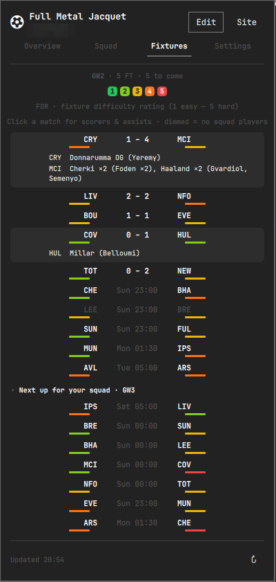
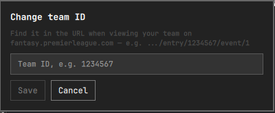

#  Omarchy FPL Tracker


A bar-widget plugin for [Omarchy](https://omarchy.org/) that turns your
Fantasy Premier League Team ID into a live gameweek tracker — correct
captain and chip math, your full squad, live scores and fixture difficulty,
rank movement, and every league you care about, right in the bar. No login,
no API key, just your public Team ID.

## Why this exists

FPL's own site (and its bonus-point recalculation in particular) is slow to
reflect what's actually happening in a live gameweek — a captain who's just
scored won't show up doubled in some of FPL's own API fields for minutes.
This widget cross-checks the endpoints that *do* update live against the
ones that lag, so the number in your bar is the same one LiveFPL and the FPL
site itself show — not a stale one — one click away in the bar instead of a
browser tab.

## Features

- **Live gameweek points, calculated correctly** — captain doubling, triple
  captain's ×3, and Bench Boost's bench points are all reflected the moment
  FPL's live data shows them, not whenever FPL's backend gets around to its
  next recalculation pass.
- **Card-based control-center UI** — a gameweek hero card (points or live
  deadline countdown, plus a live feed of your own players' goals and
  assists as they happen), stat tiles for ranks and squad value, and
  pill-style chip badges, all colored with your Omarchy theme's own tokens.
- **Season strip** — a hoverable gameweek ruler: played weeks faint, weeks
  where you played a chip in gold (hover to see which chip), a purple tick
  where FPL's half-season token allowance resets (~GW20), and this week
  glowing green while matches are in play.
- **Full squad breakdown** — starting XI and bench, each player's live
  points, a ×2/×3 badge when a multiplier applies, captain/vice pills, and
  this gameweek's £0.1m price moves (▲/▼) on your own players, one click
  into the Squad tab.
- **Fixtures tab with live scores and FDR** — every Premier League match of
  the gameweek with in-play scores, a pulsing live indicator and minute
  tracker (only while a match is actually in play — finished matches always
  settle to their final score), kickoff times, and the official 1–5 Fixture
  Difficulty Rating on both sides. Matches involving teams you own players
  from are shown at full brightness; the rest are dimmed, so your squad's
  games stand out at a glance. **Click any started match** to expand a
  mini match review — goal scorers, assisters, own goals, missed/saved
  penalties, and bookings — the same events FPL's own live feed tracks.
- **Chip tracker** — Wildcard, Free Hit, Bench Boost, and Triple Captain at a
  glance, each shown as a **Ready**, **Active**, or **Used (GW N)** pill —
  the active chip glows green, the same success green used for positive
  rank movement throughout. FPL grants one of each chip per half-season;
  the tracker re-derives which half-season window is current from the live
  gameweek calendar every refresh, so it flips back to Ready at the
  gameweek ~20 reset with no special-cased date logic.
- **Live rank movement** — a LiveFPL-style indicator: your overall rank's
  absolute and percentage change versus the last *completed* gameweek, ▲ or
  ▼, colored with your Omarchy theme's own accent — the widget follows your
  theme throughout rather than imposing its own palette (the FDR scale is
  the one deliberate exception, since green→red is the universal FDR
  convention).
- **Pick your leagues** — every classic league you're in shows up with its
  own rank and an up/down arrow by default; the Settings tab lets you hide
  the ones you don't care about, useful if you're in a lot of them.
- **Jump to the official site** — a Site button opens
  `fantasy.premierleague.com/my-team` directly, for transfers and anything
  else the widget itself doesn't do.
- **Auto-updating, and fresh on open** — live data refreshes every 90
  seconds during a gameweek; the calendar, history baseline, and next-GW
  fixtures refresh every 10 minutes; and opening the popup always triggers
  a fresh fetch so you never read stale numbers. A manual refresh button is
  always available too.
- **Keybindable** — `omarchy-shell fpl-tracker toggle` (plus `open`,
  `close`, and `tab overview|squad|fixtures|settings`) can be bound to any
  key in your Hyprland config.
- **Zero login, zero config** — only your public Team ID is needed, saved
  locally. No FPL account credentials or API key, ever.

## Screenshots

| Overview | Squad | Fixtures | Settings |
| --- | --- | --- | --- |
|  |  |  |  |

 — one click away in the bar. Icon-only by default so it blends with the rest of the bar's glyphs; your live gameweek points can be switched on in Settings.

 — onboarding takes seconds: paste your Team ID, done.

## Setup

Click the widget in the bar and enter your FPL **Team ID** — the number in
the URL when you view your team on fantasy.premierleague.com, e.g.:

```
https://fantasy.premierleague.com/entry/1234567/event/1
                                   ^^^^^^^
```

Your Team ID and Settings-tab choices (show-points-in-bar, hidden leagues)
are saved to `~/.local/state/omarchy/settings/fpl-tracker.json` and reused
on future logins. None of this is secret — it's the same public data
visible to anyone who opens your team's page on fantasy.premierleague.com.
Click "Edit" in the popup any time to change your Team ID.

## Requirements

- [Omarchy](https://omarchy.org/) with its Quickshell-based shell.
- Network access to `fantasy.premierleague.com` (the official, public FPL
  API — no authentication required for team/league data).

No other dependencies beyond Perl (needed by the one bundled helper
script described in [Security](#security) — Perl ships with every
mainstream distro), no bundled binaries, and nothing is installed outside
the plugin's own directory and the one settings file above.

## Install

```sh
omarchy plugin add https://github.com/nag3sy/fpl-tracker-omarchy-plugin --enable
```

Or manually:

```sh
git clone https://github.com/nag3sy/fpl-tracker-omarchy-plugin \
  ~/.config/omarchy/plugins/io.github.nag3sy.fpl-tracker
omarchy-shell shell rescanPlugins
omarchy plugin enable io.github.nag3sy.fpl-tracker --section right
```

## Remove

```sh
omarchy plugin remove io.github.nag3sy.fpl-tracker
```

This also stops all network activity from the plugin. It does not delete
`~/.local/state/omarchy/settings/fpl-tracker.json` (your Team ID and
Settings choices); delete that file yourself for a clean slate.

## How it works

Six official, unauthenticated FPL endpoints, polled directly from the
widget via QML's `XMLHttpRequest` — no helper scripts for network access,
and no `eval` anywhere in the plugin (the one bundled helper script,
described below, never touches the network):

| Endpoint | Used for |
| --- | --- |
| `GET /api/entry/{teamId}/` | Team/manager name, overall rank/points, **this gameweek's live points and rank**, squad value/bank, and every classic league you're in |
| `GET /api/entry/{teamId}/event/{eventId}/picks/` | Your picks, captain/vice markers, active chip, transfer cost |
| `GET /api/event/{eventId}/live/` | Every player's live gameweek points — builds the Squad tab and bench points |
| `GET /api/entry/{teamId}/history/` | Last gameweek's final overall rank (rank-movement baseline) and your chip-usage history |
| `GET /api/bootstrap-static/` | Gameweek calendar, player/team/position names, price moves, and the season's chip windows — refreshed every 10 minutes, since it's a much larger payload that rarely changes intra-day |
| `GET /api/fixtures/?event={eventId}` | **Current gameweek**: live scores/minutes, match events (goals, assists, cards — for the expandable match review) + official FDR — and **next gameweek** (static, slow-polled): the "next up for your squad" difficulty preview |

The per-gameweek `?event=` form is used deliberately: it returns one
gameweek's fixture list (~30KB) instead of the megabyte-scale full-season
`/fixtures/` payload, so both fixture requests are small, bounded, and
carried by the same mid-transfer size-cap enforcement as every other
request above. Match-review events (scorers, assists, cards) come from the
same fixture payload's `stats` array — no additional endpoints.

A note on the fixtures tab's brightness: matches involving teams that
appear in your current squad are rendered at full brightness, and all
other matches are dimmed. It's a readability device, not missing data —
every fixture in the gameweek is shown regardless.

The only other network action is the **Site** button, which opens the
fixed, hardcoded URL `https://fantasy.premierleague.com/my-team` in your
default browser — only on an explicit click, never automatically, and never
with any data appended to it.

Your Team ID is validated against `^[1-9][0-9]{0,9}$` before it's used
anywhere and is always URL-encoded. All requests are plain HTTPS GETs to the
fixed `fantasy.premierleague.com` host — nothing else is contacted, and no
credentials, tokens, or secrets exist anywhere in the plugin to leak.

League rank deltas (▲/▼) come from the API's own `entry_last_rank` field
(your rank as of the previous gameweek), not a same-session comparison, so
they stay meaningful across a single 90-second poll interval instead of
being noise.

### A note on which endpoint is actually "live"

The picks endpoint's `entry_history.points`/`entry_history.rank` only update
on FPL's periodic backend recalculation and visibly lag during a live
match — a captain who has just scored shows up doubled in the entry
endpoint's `summary_event_points`/`summary_event_rank` well before
`entry_history` catches up, sometimes by several points. This widget uses
the entry endpoint's figures for the gameweek points total and gameweek
rank, and computes bench points directly from bench picks' own live scores
via `/live/`, rather than trusting `entry_history` for either. Squad-tab
per-player contributions were always computed as *live points × FPL's own
multiplier*, so they were unaffected by this — only the Overview headline
number was, and it's fixed.

## Upcoming features

Planned, not yet built:

- **Multi-week FDR planner** — the full-season fixture list with difficulty
  filters, for transfer and chip planning beyond the next gameweek.
- **Price prediction** — flag players likely to rise or fall *next*, from
  FPL's own price-change-projection data (the Squad tab already shows this
  gameweek's moves).
- **League standings detail** — points behind the leader and the gap to the
  next rank in each of your leagues.

Have a feature request? Open an issue.

## Security

This plugin was self-reviewed against the Omarchy plugin marketplace's
security baseline before submission. Summary — full detail on the network
side is in [How it works](#how-it-works) above:

- **No command execution, anywhere.** No `sudo`, `pkexec`, `doas`, `eval`,
  or shell invocation exists in this plugin. The runtime surface is six
  `XMLHttpRequest` calls, one `Qt.openUrlExternally`, and a single spawned
  process: the plugin's own bundled helper script
  ([scripts/read-state-file](scripts/read-state-file)), executed directly
  (never via a shell) to read the state file. It's a small Perl script
  that only ever receives the settings-file path and a byte cap, prints
  the file's bytes, and touches nothing else — and it's hardened against
  the file being swapped for a symlink or FIFO between checking and
  reading, via a single `O_NOFOLLOW|O_NONBLOCK` descriptor whose `fstat()`
  type/size check and read are done against the same open descriptor, with
  the cap re-checked during the read itself.
- **One fixed host, HTTPS only.** Every request goes to the hardcoded
  `fantasy.premierleague.com` — never a user-supplied or discovered URL.
  Your Team ID is validated against `^[1-9][0-9]{0,9}$` before it's used
  anywhere and is always URL-encoded, so it can't redirect a request
  elsewhere. Every one of the six requests is aborted mid-transfer the
  moment its response crosses an endpoint-specific byte cap — checked
  against the declared `Content-Length` as soon as headers arrive, and
  again against bytes buffered so far as the body streams in — rather than
  downloaded in full and only then discarded. Every request also has an
  explicit timeout.
- **The Site button is inert data.** It opens a single hardcoded URL on an
  explicit click only — never automatically, and never with any data
  appended to it.
- **No credentials, ever.** There's nothing to steal: no login, no API key,
  no token, no session of any kind exists anywhere in the plugin.
- **Local storage is one file, and it's not sensitive.** Your Team ID and
  Settings-tab choices live in
  `~/.local/state/omarchy/settings/fpl-tracker.json` — the same public data
  anyone can already see on your team's fantasy.premierleague.com page.
  Removing the plugin doesn't delete it; see [Remove](#remove). It's read
  through the bundled helper script described above rather than
  Quickshell's `FileView`, because `FileView` has no size-limited or
  streaming read of its own — the script refuses to hand back anything
  past a generous 64KB ceiling (this file normally runs a few hundred
  bytes), and the widget falls back to the unconfigured setup prompt on
  any rejected or empty read.
- **FPL-sourced text is never treated as rich text.** Team/manager/player/
  league names come from FPL's API and are rendered with
  `textFormat: Text.PlainText` everywhere they're shown, so a crafted name
  can't be interpreted as markup. The two deliberate `StyledText` exceptions
  (the matchday snapshot and the goal feed) are built entirely from the
  plugin's own markup, with any FPL-sourced names first stripped of angle
  brackets — and unknown chip codes from the API are stripped the same way.
- **No privileges.** Never requests `sudo`/`pkexec`, never touches system
  configuration, and never reads or writes any file other than its own
  settings file above.

The one residual risk worth naming: QML's `XMLHttpRequest` has no exposed
API to restrict redirect targets or protocols, so a DNS-hijack or
compromised-cert scenario against `fantasy.premierleague.com` isn't
something this plugin can defend against at its own layer — that's a
platform limitation, not something specific to this code.

## License

MIT — see [LICENSE](LICENSE).
