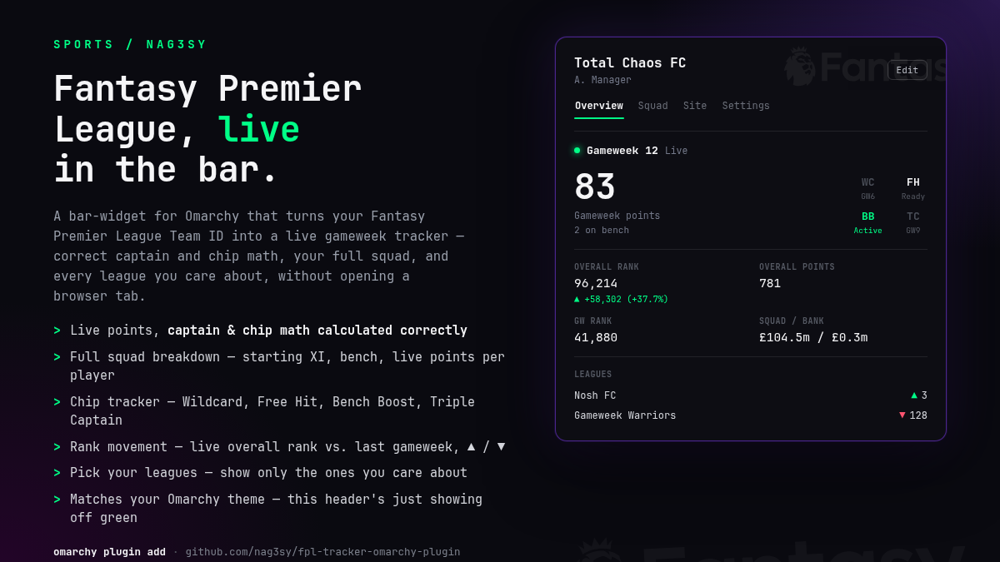
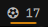
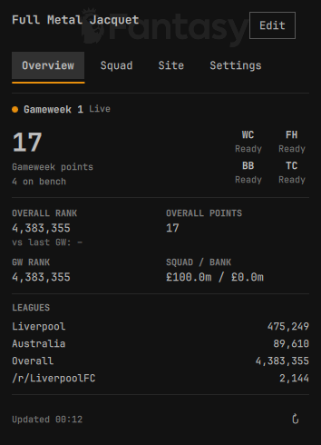
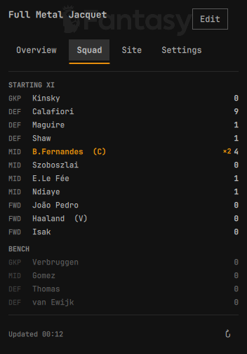
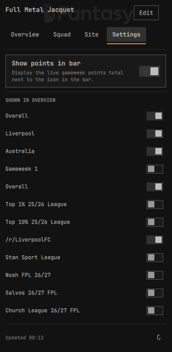

# Omarchy FPL Tracker



A bar-widget plugin for [Omarchy](https://omarchy.org/) that turns your
Fantasy Premier League Team ID into a live gameweek tracker — correct
captain and chip math, your full squad, rank movement, and every league you
care about, right in the bar. No login, no API key, just your public Team ID.

## Why this exists

FPL's own site (and its bonus-point recalculation in particular) is slow to
reflect what's actually happening in a live gameweek — a captain who's just
scored won't show up doubled in some of FPL's own API fields for minutes.
This widget cross-checks the endpoints that *do* update live against the
ones that lag, so the number in your bar is the same one LiveFPL and the FPL
site itself show — not a stale one — one click away in the bar instead of a
browser tab.

## Features

- **Live gameweek points, calculated correctly** — captain doubling, triple
  captain's ×3, and Bench Boost's bench points are all reflected the moment
  FPL's live data shows them, not whenever FPL's backend gets around to its
  next recalculation pass.
- **Full squad breakdown** — starting XI and bench, each player's live
  points, a ×2/×3 badge when a multiplier applies, and (C)/(V) captain/vice
  markers, all one click into the Squad tab.
- **Chip tracker** — Wildcard, Free Hit, Bench Boost, and Triple Captain at a
  glance, each shown as **Ready** or **Used (GW N)**. FPL grants one of each
  chip per half-season; the tracker re-derives which half-season window is
  current from the live gameweek calendar every refresh, so it flips back to
  Ready at the gameweek ~20 reset with no special-cased date logic.
- **Live rank movement** — a LiveFPL-style indicator: your overall rank's
  absolute and percentage change versus the last *completed* gameweek, ▲ or
  ▼, colored with your Omarchy theme's own accent — the widget follows your
  theme throughout rather than imposing its own palette.
- **Pick your leagues** — every classic league you're in shows up with its
  own rank and an up/down arrow by default; the Settings tab lets you hide
  the ones you don't care about, useful if you're in a lot of them.
- **Jump to the official site** — a Site button opens
  `fantasy.premierleague.com/my-team` directly, for transfers and anything
  else the widget itself doesn't do.
- **Auto-updating** — live data refreshes every 90 seconds during a
  gameweek; the calendar and history baseline refresh every 10 minutes. A
  manual refresh button is always available too.
- **Zero login, zero config** — only your public Team ID is needed, saved
  locally. No FPL account credentials or API key, ever.

## Screenshots

 — one click away in the bar.

| Overview | Squad | Settings |
| --- | --- | --- |
|  |  |  |

## Setup

Click the widget in the bar and enter your FPL **Team ID** — the number in
the URL when you view your team on fantasy.premierleague.com, e.g.:

```
https://fantasy.premierleague.com/entry/1234567/event/1
                                   ^^^^^^^
```

Your Team ID and Settings-tab choices (show-points-in-bar, hidden leagues)
are saved to `~/.local/state/omarchy/settings/fpl-tracker.json` and reused
on future logins. None of this is secret — it's the same public data
visible to anyone who opens your team's page on fantasy.premierleague.com.
Click "Edit" in the popup any time to change your Team ID.

## Requirements

- [Omarchy](https://omarchy.org/) with its Quickshell-based shell.
- Network access to `fantasy.premierleague.com` (the official, public FPL
  API — no authentication required for team/league data).

No other dependencies, no bundled binaries, and nothing is installed outside
the plugin's own directory and the one settings file above.

## Install

```sh
omarchy plugin add https://github.com/nag3sy/fpl-tracker-omarchy-plugin --enable
```

Or manually:

```sh
git clone https://github.com/nag3sy/fpl-tracker-omarchy-plugin \
  ~/.config/omarchy/plugins/io.github.nag3sy.fpl-tracker
omarchy-shell shell rescanPlugins
omarchy plugin enable io.github.nag3sy.fpl-tracker --section right
```

## Remove

```sh
omarchy plugin remove io.github.nag3sy.fpl-tracker
```

This also stops all network activity from the plugin. It does not delete
`~/.local/state/omarchy/settings/fpl-tracker.json` (your Team ID and
Settings choices); delete that file yourself for a clean slate.

## How it works

Five official, unauthenticated FPL endpoints, polled directly from the
widget via QML's `XMLHttpRequest` — no helper scripts, no spawned processes,
no `eval`/shell usage anywhere in the plugin:

| Endpoint | Used for |
| --- | --- |
| `GET /api/entry/{teamId}/` | Team/manager name, overall rank/points, **this gameweek's live points and rank**, squad value/bank, and every classic league you're in |
| `GET /api/entry/{teamId}/event/{eventId}/picks/` | Your picks, captain/vice markers, active chip, transfer cost |
| `GET /api/event/{eventId}/live/` | Every player's live gameweek points — builds the Squad tab and bench points |
| `GET /api/entry/{teamId}/history/` | Last gameweek's final overall rank (rank-movement baseline) and your chip-usage history |
| `GET /api/bootstrap-static/` | Gameweek calendar, player/team/position names, and the season's chip windows — refreshed every 10 minutes, since it's a much larger payload that rarely changes intra-day |

The only other network action is the **Site** button, which opens the
fixed, hardcoded URL `https://fantasy.premierleague.com/my-team` in your
default browser — only on an explicit click, never automatically, and never
with any data appended to it.

Your Team ID is validated against `^[1-9][0-9]{0,9}$` before it's used
anywhere and is always URL-encoded. All requests are plain HTTPS GETs to the
fixed `fantasy.premierleague.com` host — nothing else is contacted, and no
credentials, tokens, or secrets exist anywhere in the plugin to leak.

League rank deltas (▲/▼) come from the API's own `entry_last_rank` field
(your rank as of the previous gameweek), not a same-session comparison, so
they stay meaningful across a single 90-second poll interval instead of
being noise.

### A note on which endpoint is actually "live"

The picks endpoint's `entry_history.points`/`entry_history.rank` only update
on FPL's periodic backend recalculation and visibly lag during a live
match — a captain who has just scored shows up doubled in the entry
endpoint's `summary_event_points`/`summary_event_rank` well before
`entry_history` catches up, sometimes by several points. This widget uses
the entry endpoint's figures for the gameweek points total and gameweek
rank, and computes bench points directly from bench picks' own live scores
via `/live/`, rather than trusting `entry_history` for either. Squad-tab
per-player contributions were always computed as *live points × FPL's own
multiplier*, so they were unaffected by this — only the Overview headline
number was, and it's fixed.

## Upcoming features

Planned, not yet built:

- **Fixtures** — match results and live scores for the gameweek, not just
  your own points.
- **Price tracking** — flag players in your squad (or on your watchlist)
  who are likely to rise or fall in value, before it happens.
- **Fixture difficulty rating** — at-a-glance FDR for every team's next five
  gameweeks, for transfer and captaincy planning.

Have a feature request? Open an issue.

## Privileges

None. This plugin never requests `sudo`/`pkexec`, never touches system
configuration, and never reads or writes any file other than its own
settings file above.

## License

MIT — see [LICENSE](LICENSE).
